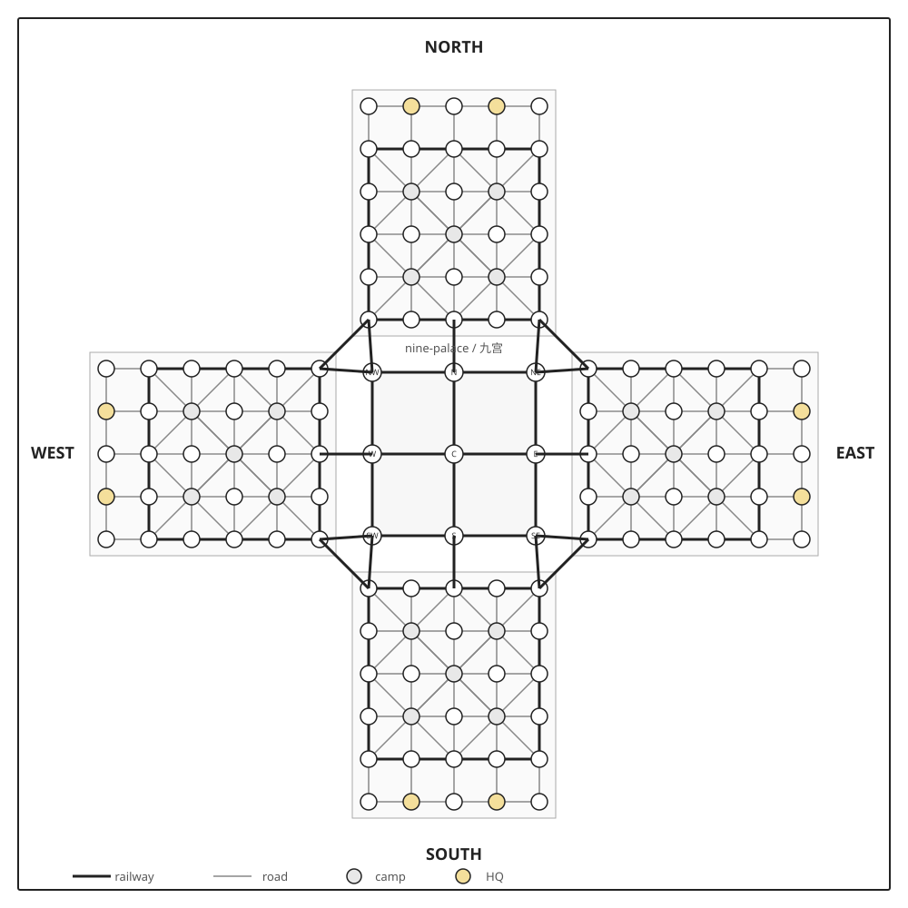

# 四国军棋棋盘布局

This is the canonical board reference for the project. It replaces the
prototype’s temporary 12×12 grid. The board is rotationally symmetric: each
country uses the same local six-row layout, rotated to face the nine-palace.



## Global orientation

```text
                              NORTH
                               row 1
                         ┌─────────────┐
                         │ 30 positions│
                         │ 6 rows × 5  │
                         └──────┬──────┘
                                ╱│╲
              WEST ─────────  ┌─┼─┐  ───────── EAST
              row 1            │九│              row 1
              faces center     │宫│              faces center
                               └─┼─┘
                                ╲│╱
                         ┌──────┴──────┐
                         │ 30 positions│
                         │ 6 rows × 5  │
                         └─────────────┘
                               SOUTH
                               row 1
```

The diagram is not a square 12×12 grid. It is four six-row country zones
around a nine-station central graph. The four countries’ row 1 is always the
front row facing the center; row 6 is always the rear row.

## One country’s exact 30 positions

Read this table from that country’s perspective. The five columns are always
ordered `1-left`, `2-left`, `3-center`, `2-right`, `1-right`.

| Row | 1-left | 2-left | 3-center | 2-right | 1-right |
| ---: | --- | --- | --- | --- | --- |
| 1, front | station | station | station | station | station |
| 2 | station | camp | station | camp | station |
| 3 | station | station | camp | station | station |
| 4 | station | camp | station | camp | station |
| 5 | station | station | station | station | station |
| 6, rear | station | HQ | station | HQ | station |

There are exactly 25 non-camp positions and exactly 5 camps. All 25 pieces
occupy the non-camp positions during deployment; camps start empty.

### Local coordinates

For implementation and replay notation, a country position is identified as
`<seat>-r<row>-<column>`:

```text
Columns:       1L       2L       3        2R       1R

r1:          r1-1L    r1-2L    r1-3    r1-2R    r1-1R
r2:          r2-1L    r2-2L    r2-3    r2-2R    r2-1R
r3:          r3-1L    r3-2L    r3-3    r3-2R    r3-1R
r4:          r4-1L    r4-2L    r4-3    r4-2R    r4-1R
r5:          r5-1L    r5-2L    r5-3    r5-2R    r5-1R
r6:          r6-1L    r6-2L    r6-3    r6-2R    r6-1R
```

Examples: `north-r1-3` is North’s front-center station;
`south-r6-2L` is one of South’s headquarters; `east-r2-2R` is a camp.

The center-facing side of each zone is row 1. The same local names are used
after rotating the zone for North, East, South, and West.

## Nine-palace coordinates

The central nine stations form this graph. Every drawn connection is railway.

```text
              NW ───── N ───── NE
               │       │       │
               │       │       │
              W  ───── C ───── E
               │       │       │
               │       │       │
              SW ───── S ───── SE
```

The nine-palace connects to the country fronts as follows:

- `N` connects to North’s front-center station.
- `NW` and `NE` connect to North’s two front outer stations.
- `E` connects to East’s front-center station; `NE` and `SE` connect to its
  two front outer stations.
- `S` connects to South’s front-center station; `SW` and `SE` connect to its
  two front outer stations.
- `W` connects to West’s front-center station; `NW` and `SW` connect to its
  two front outer stations.

The neighboring outer front stations also have railway links around the four
corners, as shown in the SVG. Those links are important: they are not road
edges and cannot be omitted from the board graph.

## Edge types

The board has only two edge types:

### Railway edges

- Horizontal edges across local rows 1 and 5.
- Vertical edges along each local outer track, columns 1L and 1R, from row 1
  through row 5.
- The nine-palace graph and its connections to the four fronts.
- The four railway links between neighboring country fronts.

### Road edges

- Horizontal adjacent edges in local rows 2, 3, 4, and 6.
- Vertical adjacent edges in columns 2L, 3, and 2R.
- The row 5-to-row 6 edge in each outer column.
- The diagonal edges surrounding the camps in rows 2, 3, and 4.

The SVG uses a thick dark line for railway and a thin gray line for road.

## Special positions

- The five camps are `r2-2L`, `r2-2R`, `r3-3`, `r4-2L`, and `r4-2R` in
  each country’s local coordinates.
- The two headquarters are `r6-2L` and `r6-2R`.
- A camp may be entered while empty but cannot be attacked while occupied.
- A piece that enters a headquarters cannot leave it.
- The flag must start in one of the two headquarters.

## Board implementation requirements

The board model must represent positions and edges explicitly rather than
inferring movement from rectangular screen distance. In particular, it must
preserve:

- the four rotations of the local six-row zone;
- the five camp positions and two headquarters in every zone;
- the nine central railway stations;
- the diagonal road edges around camps;
- the outer railway loops and corner links; and
- railway direction information, so non-engineers cannot turn while engineers
  can.

The executable board contract is [`board.v2.json`](../contracts/board.v2.json).
The older [`board.v1.json`](../contracts/board.v1.json) is retained only as a
historical record of the removed prototype.
